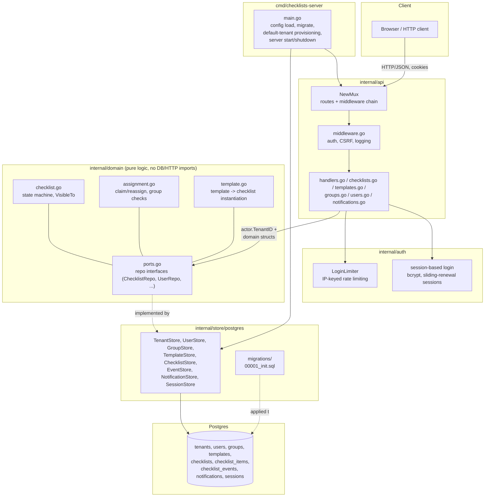
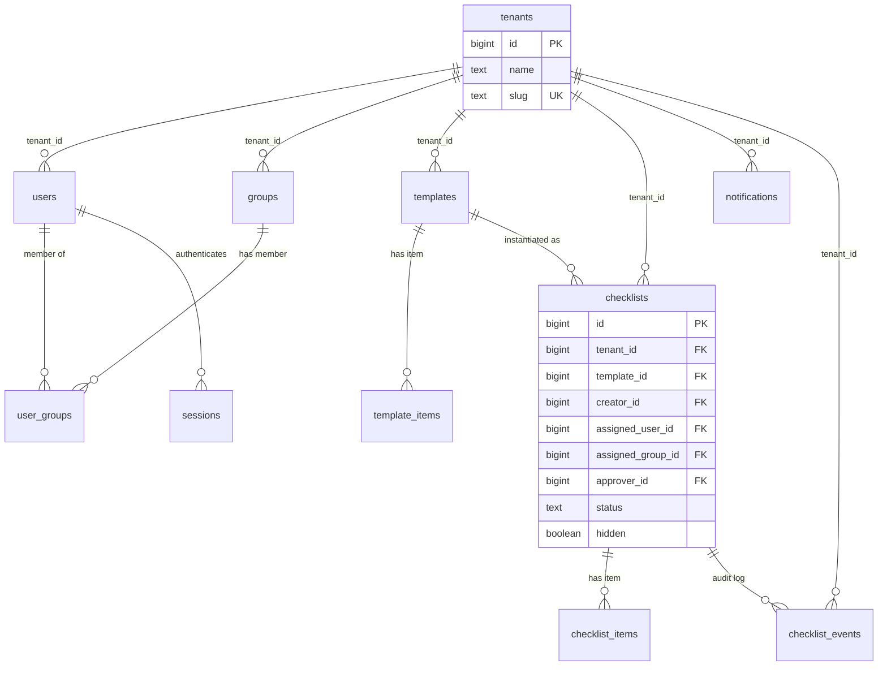

# Architecture

Graphical companion to [DESIGN.md](../DESIGN.md#architecture) — kept here as a
standalone reference. These are [Mermaid](https://mermaid.js.org/) diagrams;
GitHub renders them inline, and most editors (GoLand, VS Code) do too with a
Mermaid plugin.

## Component / package structure



## Request lifecycle (authenticated write)

Example: `POST /checklists/{id}/check` — an authenticated, CSRF-protected,
tenant-scoped state transition.

```mermaid
sequenceDiagram
    participant C as Client
    participant MW as Middleware\n(auth, CSRF, logging)
    participant H as Handler\n(checklists.go)
    participant Dom as domain\n(checklist.go)
    participant Repo as ChecklistStore\n(postgres)
    participant DB as Postgres

    C->>MW: POST /checklists/{id}/check\nCookie: checklists_session\nX-CSRF-Token header
    MW->>MW: resolve session -> actor (*domain.User)\nvalidate X-CSRF-Token == checklists_csrf cookie
    MW->>H: r.Context() carries actor (incl. TenantID)
    H->>Repo: Get(ctx, actor.TenantID, id)  [FOR UPDATE]
    Repo->>DB: SELECT ... WHERE tenant_id = $1 AND id = $2 FOR UPDATE
    DB-->>Repo: checklist row
    Repo-->>H: *domain.Checklist
    H->>Dom: checklist.VisibleTo(actor), state transition rules
    Dom-->>H: ok / error
    H->>Repo: transaction: update checklist + insert checklist_event
    Repo->>DB: BEGIN; UPDATE checklists ...; INSERT INTO checklist_events ...; COMMIT
    DB-->>Repo: ok
    Repo-->>H: ok
    H-->>C: 200 OK, updated checklist JSON
```

## Multi-tenancy data model

Composite `UNIQUE(tenant_id, id)` on each root table plus composite FKs from
every child table pin every row to a single tenant at the database level, not
just in application code. See [DESIGN.md — Multi-tenancy](../DESIGN.md#multi-tenancy)
for the full rationale.


