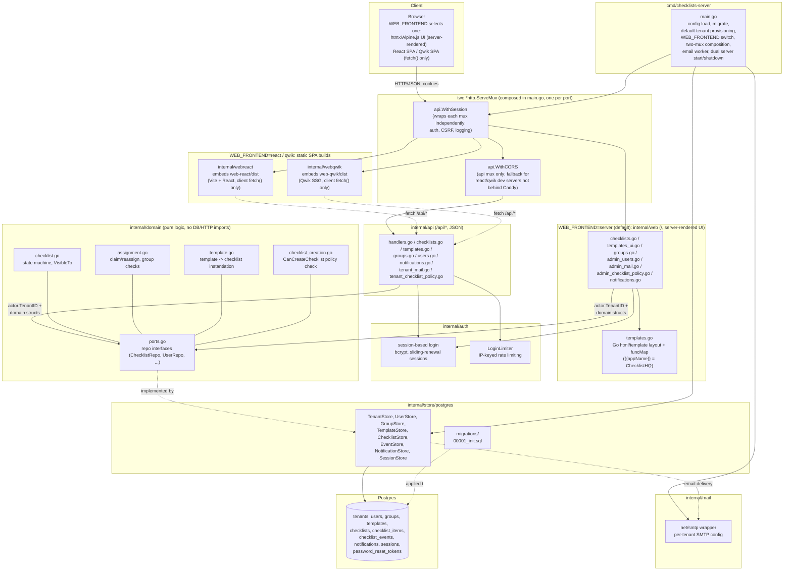
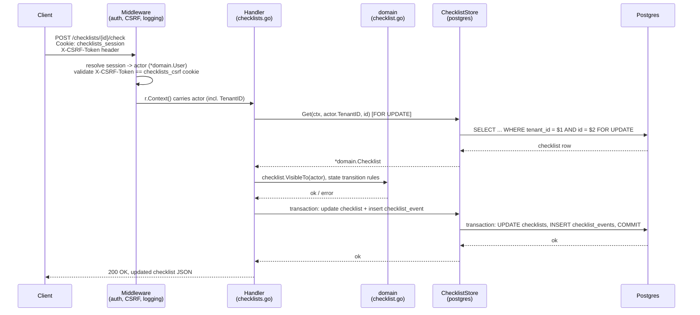

# Architecture

Graphical companion to [DESIGN.md](../DESIGN.md#architecture) — kept here as a
standalone reference. These are [Mermaid](https://mermaid.js.org/) diagrams;
GitHub renders them inline, and most editors (GoLand, VS Code) do too with a
Mermaid plugin.

## Component / package structure

`internal/web` does not import `internal/api` (or vice versa) — each
registers its own routes onto its own mux (one per port) and implements its
own handler logic against the same `internal/domain`/`internal/store` layers,
even where that means near-duplicate code between the two packages.
`internal/webreact`/`internal/webqwik` are different in kind, not just
degree: they don't touch `internal/domain`/`internal/store` at all — they
serve a static build and talk to `internal/api` exclusively over HTTP, the
same as any other API client. The one exception to the "no cross-imports"
rule is auth: `main.go` calls the exported `api.RegisterAuthRoutes` on every
web-port mux so `/login`, `/register`, `/logout` work regardless of which
`WEB_FRONTEND` is active, without `internal/web`/`internal/webreact`/
`internal/webqwik` importing `internal/api` themselves. See
[DESIGN.md — Frontend](../DESIGN.md#frontend) for why.

## Request lifecycle (authenticated write)

Example: `POST /checklists/{id}/check` — an authenticated, CSRF-protected,
tenant-scoped state transition.

## Multi-tenancy data model

Composite `UNIQUE(tenant_id, id)` on each root table plus composite FKs from
every child table pin every row to a single tenant at the database level, not
just in application code. See [DESIGN.md — Multi-tenancy](../DESIGN.md#multi-tenancy)
for the full rationale.

```mermaid
erDiagram
    tenants ||--o{ users : "tenant_id"
    tenants ||--o{ groups : "tenant_id"
    tenants ||--o{ templates : "tenant_id"
    tenants ||--o{ checklists : "tenant_id"
    tenants ||--o{ notifications : "tenant_id"
    tenants ||--o{ checklist_events : "tenant_id"
    users ||--o{ user_groups : "member of"
    groups ||--o{ user_groups : "has member"
    templates ||--o{ template_items : "has item"
    templates ||--o{ checklists : "instantiated as"
    checklists ||--o{ checklist_items : "has item"
    checklists ||--o{ checklist_events : "audit log"
    users ||--o{ sessions : "authenticates"
    users ||--o{ password_reset_tokens : "requests reset"

    tenants {
        bigint id PK
        text name
        text slug UK
        text smtp_host
        int smtp_port
        text smtp_username
        text smtp_password
        text smtp_from_address
        boolean restrict_checklist_creation
        bigint checklist_creator_group_id FK
    }
    users {
        bigint id PK
        bigint tenant_id FK
        text username UK
        text email
        boolean is_admin
        boolean is_active
    }
    checklists {
        bigint id PK
        bigint tenant_id FK
        bigint template_id FK
        bigint creator_id FK
        bigint assigned_user_id FK
        bigint assigned_group_id FK
        bigint approver_id FK
        text status
        boolean hidden
    }
    notifications {
        bigint id PK
        bigint tenant_id FK
        bigint user_id FK
        text email_status
        int email_attempts
        text email_last_error
        timestamptz email_sent_at
    }
```

