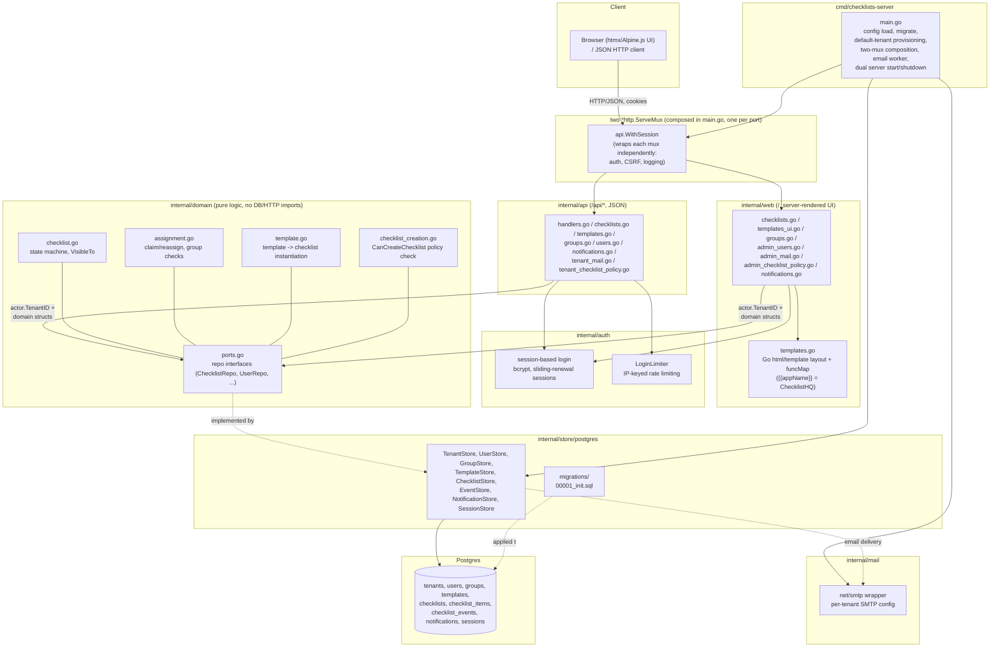
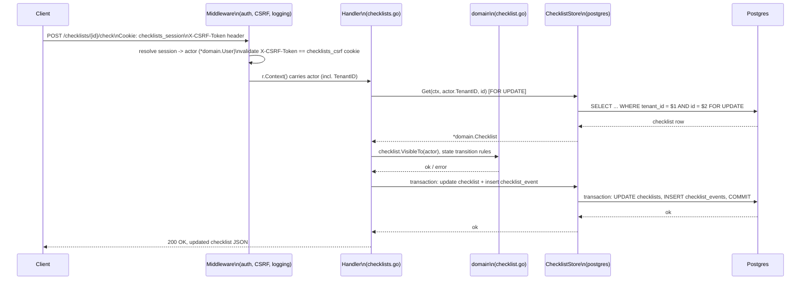
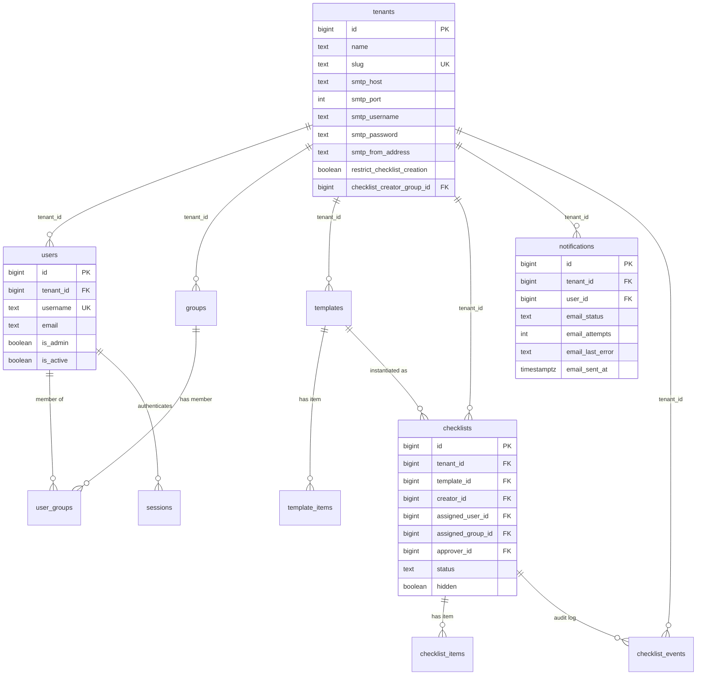

# Architecture

Graphical companion to [DESIGN.md](../DESIGN.md#architecture) — kept here as a
standalone reference. These are [Mermaid](https://mermaid.js.org/) diagrams;
GitHub renders them inline, and most editors (GoLand, VS Code) do too with a
Mermaid plugin.

## Component / package structure

`internal/web` does not import `internal/api` (or vice versa) — each
registers its own routes onto its own mux (one per port) and implements its
own handler logic against the same `internal/domain`/`internal/store` layers,
even where that means near-duplicate code between the two packages. The one
exception is auth: `main.go` calls the exported `api.RegisterAuthRoutes` on
both muxes so `/login`, `/register`, `/logout` work on either port without
`internal/web` importing `internal/api`. See
[DESIGN.md — Frontend](../DESIGN.md#frontend) for why.

## Request lifecycle (authenticated write)

Example: `POST /checklists/{id}/check` — an authenticated, CSRF-protected,
tenant-scoped state transition.

## Multi-tenancy data model

Composite `UNIQUE(tenant_id, id)` on each root table plus composite FKs from
every child table pin every row to a single tenant at the database level, not
just in application code. See [DESIGN.md — Multi-tenancy](../DESIGN.md#multi-tenancy)
for the full rationale.

